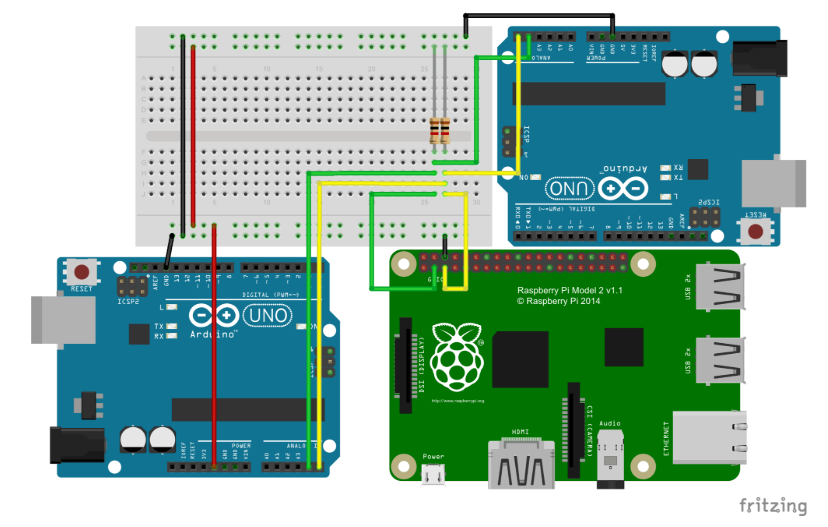

# ControladorMicrored
This project contains a master-slave architecture between Raspberry-Pi and Arduino, using I2C protocol. It is used to control 
a renewable energy micro grid.


## Installation 
### Master
To setup the master project you first have to install all dependencies as follows.
 ``` bash
 $ pip install -r requirements.txt
 ```
 ### Slaves